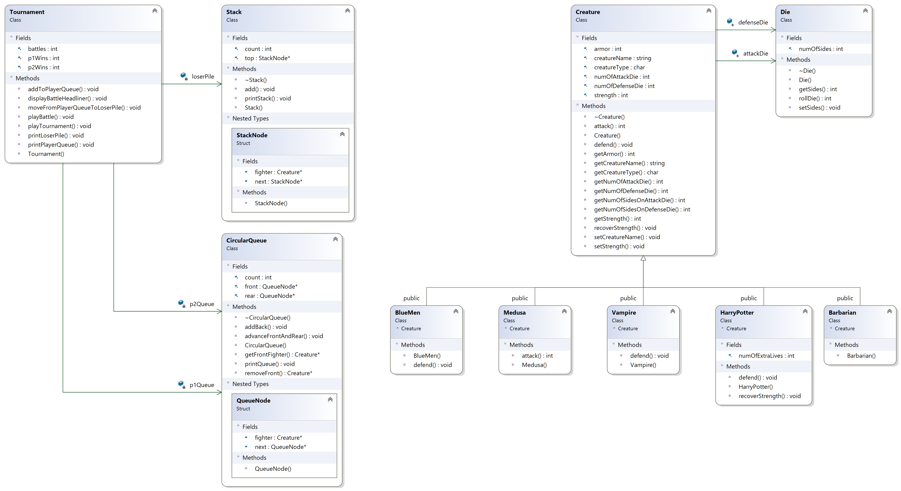

# Text-Based Fighting Simulation Game: Fantasy Combat Vol. II - Tournament

Fantasy Combat Vol. II - Tournament is a text-based fighting simulation game coded in C++. It is an extension of [Fantasy Combat Vol. I](https://github.com/liderrick/Text-Based-Fighting-Simulation-Game--Fantasy-Combat-Vol.-I). In this game, Vol. II, characters are selected and placed in a line-up for tournament-style battles, as oppose to individual battles in [Vol. I](https://github.com/liderrick/Text-Based-Fighting-Simulation-Game--Fantasy-Combat-Vol.-I).

There are 1 user and 2 Players. The user chooses the number of fighters to assign to each Player and chooses the fighter types (and their names). The Player chooses their lineup from the list of available fighters that the user assigned to them. The game runs automatically. In each battle, the fighters at the front of the Queue fight. They fight until one Creature has no more (or negative) strength.

The winning fighter has some of its strength regenerated and placed in the back of the winning Player's Queue. The losing fighter is removed from the losing Player's Queue and placed into the loserPile Stack, the stack of fighters who lost. The fighters battle until one Queue has no more Creatures to battle.

The final score and winning Player are announced. The winning Player is the Player with the most wins. If the number of wins are the same between both Players, then a Tie is announced. At the end, there is an option to display the list of fighters who lost.

## Instructions
1. Run `make` to compile.
2. Run `project.exe` to run game.

## Class Diagram

